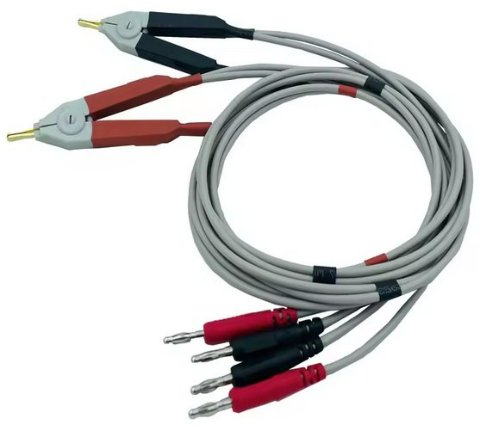

### Overview

The EEZ DIB DCP405+ Power module is an improved version of the [DCP405](https://github.com/eez-open/modular-psu/tree/master/dcp405) module that now includes an on-board 32-bit MCU, a more accurate and faster A/D converter for simultaneous voltage and current measurement (and thus more accurate power measurement).
This version features remote current programming in addition to the existing remote voltage programming. Sense inputs are also on 4 mm safety sockets, which now enables widely accessible (e.g. AliExpress, eBay, etc.) and affordable Kelvin cable sets (Power/Sense) as for LCR meters (see below)

### Feature list
- Power input: 48 Vdc (e.g. Mean Well EPP-150-48 or LRS-150F-48)
- Max. output power: 155 W (as limited with Mean Well AC/DC module capacity) 
- Voltage regulation (CV), 0 – 40 V. Voltage set resolution (_U_SET_): 16-bit, read resolution (_U_MON_): 15-bit
- Current regulation (CC) with 2-range (50 mA, 5 A). Current set resolution (_I_SET_): 16-bit, Current read resolution (_I_MON_): 20-bit for each range
- On-board low EMI switching power pre-regulator and bias power supply
- On-board OVP with full range dual crowbar (triac/MOSFET) and 20x5 mm fuse
- Down-programmer
- Output enable (OE) circuit with LED indicator combined with coupling indication
- On-board Ø4 mm safety sockets (19.05 mm/0.75” pitch) for Power outputs and Sense inputs 
- Pass-thru connector for power output coupling with other power boards for e.g. doubling output voltage (up to 80 V) or current (up to 10 A)
- Remote voltage sense with LED indicator and inverse polarity protection
- Remote voltage and current programming with LED indicator (+2.5 V for full range)
- On-board 32-bit 250 MHz MCU ([STM32H503CBT6](https://www.st.com/en/microcontrollers-microprocessors/stm32h503cb.html))
- Galvanically isolated SPI bus
- I2C EEPROM for storing board specific configuration and calibration parameters
- SPI Temperature sensor
- Dimensions: 180 x 103.5 mm, 4-layer PCB
- **CE certified design**

---

This work is financed by [NLnet](https://nlnet.nl/) foundation

